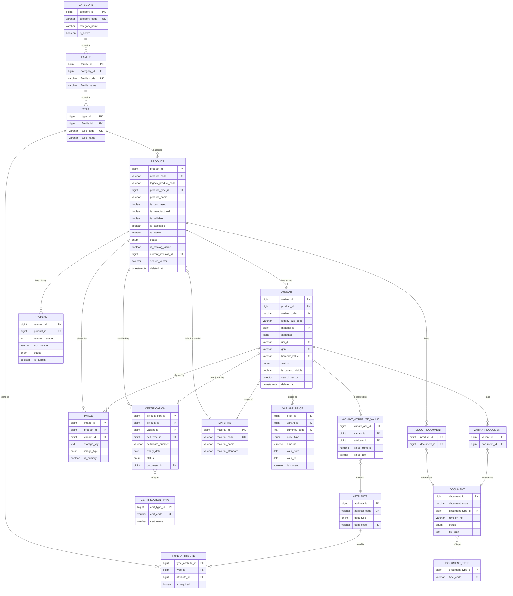

# Medical Device ERP — Product Management Module
## Architecture Review, Redesign & Scale-Up Plan (V1 → V2)

Companion files: [`sql/001_schema_v2.sql`](../sql/001_schema_v2.sql) (full DDL, tested against PostgreSQL 16) and [`sql/002_migration_v1_to_v2.sql`](../sql/002_migration_v1_to_v2.sql) (V1 → V2 data migration, tested against the actual `products.csv` / `variants.csv` you supplied — see validation log at the end of this document).

All findings below are grounded in profiling the actual data (1,469 products, 25,358 variants), not assumptions.

---

## 1. Existing Database — Field-by-Field Analysis

### 1.1 `products` (1,469 rows)

| Column | Purpose | Disposition | Why |
|---|---|---|---|
| `product_id` | Surrogate PK | **Keep** | Correct as-is; becomes `product.product.product_id` (BIGINT identity for headroom). |
| `product_name` | Display name | **Keep, tighten** | Keep, but stop encoding variants into the name (`"...(HA Coated) (Sterile)"` — see §7). Add FTS index. |
| `product_code` | Business/catalog code | **Fix, then Keep** | **Not actually unique today** — 83 codes are shared by 2–3 distinct products (e.g. code `501` used by both "4.5mm Monoaxial Screw" and its HA-Coated version). This is a real data-integrity gap, not a design opinion — proven by profiling. V2 keeps `product_code` as the business key but enforces uniqueness and adds `legacy_product_code` to preserve the original value verbatim. See §7 and §22. |
| `category_id` | FK to a category | **Convert to Master table** | Only 8 distinct integers exist and **no table has ever backed them** — there is no name, no description, nothing to display in a UI. This is the textbook case for "Convert into a Master table." → `product.category`. |
| `image_path` | Single image filename | **Move to separate table** | One image per product is a hard ceiling for an enterprise catalog (marketing needs gallery shots, technical drawings, packaging labels, 360° views). → `product.image`. See §7 and §20. |
| `product_show` | Storefront visibility flag | **Rename, keep** | Renamed to `is_catalog_visible` — the old name conflated "is this a real, in-use product" with "should the catalog/storefront display it," which are different questions once Sales/e-commerce becomes a real module. |
| `ce_certified` | CE mark boolean | **Convert to Lookup + Relationship table** | Hard-coding one column per regulator does not scale — CDSCO, FDA 510(k), ANVISA, UKCA, ISO 13485 will all need the same treatment eventually. → `product.certification_type` (lookup) + `product.certification` (relationship, with certificate number/dates/document). See §7. |
| `cdsco_certified` | CDSCO boolean | **Same as above** | Same fix. Additionally: profiling found the **variant-level** `cdsco_certified` disagrees with the product-level value for 1,501 of 25,358 variants (~6%) — always in the direction "product is certified, this specific SKU is not." That's a genuine business rule (a real regulatory override), which the flat boolean-per-table design cannot express safely. V2's `product.certification.variant_id` (nullable) captures exactly this. |
| `product_sterile` | Sterile packaging flag | **Keep, rename** | Kept at product level (matches how the data actually models it — "(Sterile)" variants are separate `product_id`s already), renamed `is_sterile`. |
| `is_active` | Active flag | **Replace with ENUM** | Currently **100% `Yes`** across all 1,469 rows — as a boolean it is not doing any work today, but a real ERP needs more lifecycle states than active/inactive (draft, pending approval, discontinued, obsolete). → `status product.lifecycle_status`. |
| `remark` | Free text note | **Keep** | Harmless free-text field; kept as `product.product.remark`. |
| `created_by_user_id` | Audit stub | **Keep, formalize** | Kept as `created_by`, FK to a real (if minimal) `core.app_user` table instead of a bare unchecked integer. Paired with `created_at`/`updated_by`/`updated_at` which V1 lacked entirely — you cannot answer "who changed this and when" today. |

### 1.2 `variants` (25,358 rows)

| Column | Purpose | Disposition | Why |
|---|---|---|---|
| `variant_id` | Surrogate PK | **Keep** | Correct as-is. |
| `product_id` | FK to parent product | **Keep** | Correct as-is. |
| `product_code` | Denormalized copy of parent's code | **Remove** | 100% redundant — every one of the 25,358 rows matches its parent product's code exactly (verified). Pure denormalization with zero data-quality upside; drop it and join to `product.product` when needed. |
| `size_code` | SKU-ish code | **Rename + fix uniqueness** | Unique **within a product** (0 collisions on `product_id,size_code`) but **not globally** (18 collisions across different products). Renamed `variant_code` and re-derived as `product_code‖size_code` so it is globally unique — a real requirement once this becomes the SKU used by Inventory/Sales/Purchasing. Original value preserved verbatim in `legacy_size_code`. |
| `udi_number` | Unique Device Identifier | **Keep, rename** | Already 100% unique in the data — good. Renamed `udi_di` to be explicit this is the *static* Device Identifier half of a UDI; the *Production Identifier* half (lot/serial/expiry) is a **traceability/inventory** concern, not a variant-master concern — see §26. |
| `material_id` | FK to material | **Convert to Master table** | Same problem as `category_id`: only integers, no names table. Values observed: `1, 2, NULL, 4` — **`3` never appears**, a gap worth investigating with engineering (deleted material? data-entry skip?). → `product.material`. |
| `size` | Free-text dimension | **Decompose (Master + EAV/JSON hybrid)** | This is the messiest column in the dataset: 1,586 distinct values, inconsistent formats (`"06mm"`, `"150mm"`, `"4 Hole"`, `"11∅"` with corrupted encoding, quoted multi-dimension strings like `"10 x 12 x 15"`). Free text can't be filtered, ranged, or reported on ("find all screws 4–6mm diameter" is currently impossible without regex). → structured `product.attribute` + `product.variant_attribute_value` (typed, queryable) **and** a fast-read `attributes` JSONB column, with the original string preserved as `legacy_size_text` for display continuity. See §7, §13, §15. |
| `price_inr` | INR price | **Move to history table** | A flat column can only ever hold "today's price" — no effective-dated history, no audit of price changes. Also 11,198 of 25,358 rows (44%) have this blank, meaning many SKUs are effectively unpriced today. → `product.variant_price`. |
| `price_usd` | USD price | **Move to history table** | Same fix, plus this hard-codes a second currency as a *column* — the wrong axis. Currency should be a *row* (`currency_code`) so adding EUR/GBP later needs zero schema change. |
| `mrp` | MRP (India) | **Move to history table** | Modeled as a `price_type` value, not a separate column, for the same reason. |
| `variant_show` | Storefront visibility | **Rename, keep** | Same treatment as `product_show` → `is_catalog_visible`. |
| `ce_certified` | CE boolean (variant level) | **Remove (redundant)** | Verified **100% identical** to the parent product's value across all 25,358 rows — pure duplication, zero information content. Removed; variants inherit the product-level `product.certification` row. |
| `cdsco_certified` | CDSCO boolean (variant level) | **Convert to override relationship** | As above — this one is *not* redundant (6% genuine disagreement), so it becomes a variant-scoped override row in `product.certification`, not a duplicated column. |
| `created_by_user_id` | Audit stub | **Keep, formalize** | Same treatment as on `products`. |

**Net effect:** 12 + 14 = 26 legacy columns become 2 tables with ~9 usable business columns each, backed by 10 new master/lookup tables and 5 new transaction/relationship tables — nothing is lost, several real bugs (duplicate product codes, redundant CE flag, unqueryable size text) are fixed, and every future module (Inventory, BOM, QC, Sales...) has a clean FK surface to attach to.

---

## 2. Product Hierarchy — Category → Family → Type → Product → Variant

```
Category   (Trauma / Spine / CMF / Sports Medicine ...)
   └─ Family    (Screws / Plates / Nails / Instruments ...)
        └─ Type      (Cortex Screw / Locking Plate / Cannulated Nail ...)
             └─ Product   (1.5mm Cortex Screw)
                  └─ Variant   (SKU: 1.5mm × 6mm length, Ti-alloy)
```

**Why this exact hierarchy, and why 5 explicit levels instead of one recursive `parent_id` tree:**

- **It matches how orthopedic catalogs are actually organized** (and how SAP Material Groups / Oracle Item Categories / Dynamics Product Categories model medical device catalogs): a fixed, shallow, well-understood depth is easier for a UI to render as breadcrumbs/filters than an arbitrary-depth tree, and easier for non-technical catalog admins to maintain.
- **Type is the natural home for the "variant configuration template"** — every *Cortex Screw* needs Diameter+Length; every *Locking Plate* needs Hole Count+Angle. `product.type_attribute` hangs off `type_id`, so the UI knows what fields to prompt for the moment a product's Type is chosen — this is exactly how SAP Variant Configuration and Siemens Teamcenter classification structures work.
- **Product is the design/regulatory unit** (one Design History File, one set of certifications, one revision history) and **Variant is the sellable/stockable/traceable unit** (one price, one UDI-DI, one inventory SKU) — this split is what lets Inventory, Sales, and Purchasing all key off `variant_id` while QC/Regulatory/Document Control key off `product_id`, without either module needing to know about the other's concerns.
- A **recursive self-referencing `category` table was considered and rejected**: your data only ever needs 3 fixed levels above Product, and a recursive tree would force every query (breadcrumbs, "all products under Trauma") into a recursive CTE for no real flexibility gain — YAGNI here.

---

## 3. Complete Database Architecture

Full DDL (tested end-to-end, see §27) lives in `sql/001_schema_v2.sql`. Summary by category:

### 3.1 Master Tables
| Table | Purpose |
|---|---|
| `product.category` | Top of hierarchy (was: bare `category_id` int). |
| `product.family` | 2nd level, FK to category. |
| `product.type` | 3rd level, FK to family; carries the attribute template. |
| `product.product` | Product/device master (was: `products`). |
| `product.variant` | SKU master (was: `variants`). |
| `product.material` | Material master (was: bare `material_id` int). |
| `core.app_user` | Minimal user stub so `created_by`/`updated_by` FKs resolve (full identity module out of scope). |
| `core.currency`, `core.uom`, `core.country` | Shared reference masters reused by every future module. |

### 3.2 Lookup Tables
| Table | Purpose |
|---|---|
| `product.certification_type` | CE / CDSCO / FDA 510(k) / ISO 13485 / ANVISA... — add a regulator by adding a row, never a column. |
| `product.attribute` | Vocabulary of variant-distinguishing attributes (Diameter, Length, Angle, Hole Count, Cannulated...). |
| `core.document_type` | IFU / Datasheet / Drawing / Certificate / COA. |

### 3.3 Relationship Tables
| Table | Purpose |
|---|---|
| `product.type_attribute` | Which attributes apply/are required for a given Type (the configuration template). |
| `product.certification` | Product- or variant-scoped certification instances (replaces both boolean columns and models the real override case found in §1.2). |
| `product.product_document`, `product.variant_document` | Explicit join tables linking controlled documents to products/variants (no polymorphic FK — every link is real, indexable, FK-enforced). |

### 3.4 Attachment Tables
| Table | Purpose |
|---|---|
| `product.image` | Multi-image gallery per product and/or variant (replaces single `image_path`). |
| `core.document` | Controlled-document register (IFU, datasheets, drawings, certificates) with its own revision/approval/status — the seed of a future Document Control module. |

### 3.5 Transaction Tables
| Table | Purpose |
|---|---|
| `product.variant_price` | Effective-dated, multi-currency, multi-price-type price history (replaces `price_inr`/`price_usd`/`mrp`). |
| `product.revision` | ECN-driven Design History File / revision trail per product. |
| `product.variant_attribute_value` | Typed, queryable variant attribute values (the structured half of the `size` decomposition). |

### 3.6 Audit Tables
| Table | Purpose |
|---|---|
| `core.audit_log` | Generic, monthly-partitioned, trigger-populated audit trail covering every tracked table (product, variant, price, certification, revision) with old/new JSONB snapshots — no per-table audit tables needed, ever. |

Every table's full column list, data types, PK, FKs, indexes, constraints, defaults, and validation rules are in `sql/001_schema_v2.sql`, which is executable and was run against a live PostgreSQL 16 instance (see §27 validation log) — nothing below is untested paper design.

---

## 4. Entity-Relationship Diagram



---

## 5. Product Details Page — Information Architecture

| Tab | Contents | Backing tables |
|---|---|---|
| **Overview** | Name, code, category/family/type breadcrumb, status badge, sterile/manufactured/sellable flags, short + long description, current revision badge | `product.product`, `product.type`→`family`→`category` |
| **Variants** | Sortable/filterable SKU grid: variant code, structured attributes (diameter/length/...), material, status, current price, UDI | `product.variant`, `variant_attribute_value`, `variant_price`, `material` |
| **Documents** | IFU, datasheets, drawings — grouped by `document_type`, each with revision/status/effective date and a download link | `product.product_document` → `core.document` |
| **Images** | Primary hero image + gallery + technical drawings + packaging shots, drag-to-reorder | `product.image` |
| **Pricing** | Current price by currency/price-type, plus a "view history" expander showing every prior `valid_from`–`valid_to` band | `product.variant_price` |
| **Revision History** | Timeline of ECNs: revision code, change description, reason, requested/approved by+at, effective date | `product.revision` |
| **Certificates** | One row per certification (CE, CDSCO, ...), status, certificate number, issuing authority, expiry countdown, linked certificate PDF; variant-scoped overrides shown inline against the specific SKU | `product.certification` → `certification_type`, `core.document` |
| **Audit Log** | Chronological old→new diff feed for this product (and, filterable, its variants/prices/certs) | `core.audit_log` filtered by `table_name`/`record_pk` |
| **Attachments** | Catch-all for anything not IFU/datasheet/drawing/certificate (internal notes, vendor correspondence) | `core.document` with `document_type = 'OTHER'`, joined via the same `product_document` table |

---

## 6. Naming Conventions

| Object | Convention | Example |
|---|---|---|
| Schema | one per ERP module, lowercase | `product`, `inventory`, `quality` |
| Table | singular noun, `snake_case`, no module prefix (the schema *is* the prefix) | `product.variant`, not `product.tbl_variants` |
| Column | `snake_case`, no Hungarian/type prefixes | `product_code`, not `str_ProductCode` |
| Primary key | `<table>_id`, `BIGINT GENERATED ALWAYS AS IDENTITY` | `variant_id` |
| Foreign key column | same name as the referenced PK | `product.variant.product_id` → `product.product.product_id` |
| Foreign key constraint | `fk_<table>_<referenced_table>` | `fk_variant_product` |
| Unique constraint/index | `uq_<table>_<columns>` | `uq_product_code_live` |
| Check constraint | `ck_<table>_<rule>` | `ck_certification_dates` |
| Index | `idx_<table>_<columns>` | `idx_variant_product_status` |
| Enum type | `<schema>.<name>` singular, snake_case | `product.lifecycle_status` |
| Boolean column | `is_<adjective>` / `has_<noun>` | `is_sterile`, `has_lot_tracking` |

---

## 7. Answers to Your Specific Design Questions

- **Should Product Code stay?** Yes, but fixed. It's the right *business key* for catalog/label/UI purposes — customers and sales reps think in product codes, not surrogate IDs. It just needs a real uniqueness guarantee, which it lacks today (83 duplicated codes, proven by profiling). V2 keeps `product_code` unique among live rows and preserves the original value in `legacy_product_code`.
- **Should Variant Code change?** Yes. `size_code` is only unique *within* a product (globally it collides 18 times) and is meaningless out of context. V2 renames it `variant_code`, derives it as `product_code‖legacy_size_code` for guaranteed global uniqueness, and keeps the old value in `legacy_size_code` for traceability.
- **Should Material become a Master Table?** Yes — it was already a normalized FK in spirit (an integer ID), just missing the table behind it. Now it also carries standard/grade/biocompatibility, which QC and Regulatory will need.
- **Should Images become a separate table?** Yes — a single `image_path` string cannot represent a gallery, a technical drawing, and a packaging shot at once, and can't support multiple images per SKU either. `product.image` supports both product- and variant-level images with type and ordering.
- **Should Certifications become separate?** Yes, and the data itself proves why: the two boolean columns can't express the 1,501 real variant-level CDSCO overrides found during profiling, and hard-coding one column per regulator doesn't scale past CE/CDSCO to FDA/ANVISA/UKCA. A relationship table with a lookup behind it fixes both.
- **Should Product Revision become separate?** Yes — this is a hard regulatory requirement (ISO 13485 / 21 CFR 820.30 Design History File, EU MDR technical documentation), and V1 has *no* revision concept at all today. `product.revision` adds ECN number, reason for change, and an approval trail.
- **Should Pricing History become separate?** Yes — flat columns can only ever hold "today's price," can't audit changes, and hard-code currency as a column instead of a value. `product.variant_price` fixes all three, and 44% of variants currently have no INR price at all (worth investigating separately as a data-completeness issue).

---

## 8. PostgreSQL Optimization Recommendations

- **BIGINT identity PKs everywhere**, not `INT`/`SERIAL` — at 100k products × dozens of SKUs each, plus years of price/audit history, staying under 2^31 is not guaranteed, and there's no cost to using BIGINT from day one.
- **Partial unique indexes** (`WHERE deleted_at IS NULL`) instead of plain UNIQUE constraints on business keys — enables soft delete without permanently burning a code/SKU/UDI.
- **GENERATED ALWAYS AS (…) STORED tsvector columns** for full-text search (see §12) instead of a separate trigger-maintained column — one less trigger to keep in sync, guaranteed consistency.
- **BRIN indexes** on `audit_log.changed_at` (and any future high-volume append-only time-series table like inventory transactions) — BRIN is orders of magnitude smaller than B-tree for naturally-ordered timestamp columns at this scale.
- **Monthly range partitioning on `audit_log`** (and later, inventory ledgers) with a `DEFAULT` partition as a safety net — keeps each partition's indexes small and lets you drop/archive old partitions in O(1) instead of a slow `DELETE`.
- **`pg_partman`** in production instead of the ad-hoc partition-creation loop in `001_schema_v2.sql` — that loop is fine to bootstrap the first 12 months, but ongoing partition maintenance should be automated.
- **Autovacuum tuning** on `product.variant` and `product.variant_price` once they reach millions of rows (lower `autovacuum_vacuum_scale_factor`, since these are wide, frequently-updated tables where bloat compounds quickly).
- **`jsonb_path_ops` GIN index** on `variant.attributes` (already in the DDL) — smaller and faster than the default `jsonb_ops` for containment queries (`attributes @> '{"diameter_mm":6}'`), at the cost of not supporting the `?` key-existence operator, which this use case doesn't need.
- **Connection pooling (PgBouncer, transaction mode)** once Inventory/Sales/Purchasing modules add concurrent write load — not a schema concern, but worth flagging now since the schema is deliberately module-partitioned to make this easy to scale horizontally per workload later.

## 9. Fields Recommended as ENUMs
`product.lifecycle_status`, `product.variant_status`, `product.certification_status`, `product.price_type`, `product.image_type`, `core.document_status`, `core.audit_action` — all small (≤6 values), stable, and don't vary by geography/tenant. **Not** used for regulatory class or certification body — see §10, those vary by jurisdiction and change over time, which favors a lookup table over an enum (adding an enum value requires a schema migration; adding a lookup row doesn't).

## 10. Fields Recommended as Lookup Tables
`product.category`, `product.family`, `product.type`, `product.material`, `product.certification_type`, `product.attribute`, `core.document_type`, `core.currency`, `core.uom`, `core.country`. Rule of thumb applied throughout: **ENUM when the value set is small/fixed/code-defined; lookup table when business users need to add/rename/deactivate values without a deployment.**

## 11. Fields Recommended as JSON
Only `product.variant.attributes` (JSONB) — a deliberately narrow use, because JSON is being used here as a *display/read* convenience layered on top of the normalized `variant_attribute_value` table, not as a replacement for it. Nowhere else in the schema is JSON used to avoid modeling a real relationship — that would be an anti-pattern at this scale (untyped, unindexable-by-default, not FK-enforceable).

## 12. Full-Text Search Fields
- `product.product.search_vector`: weighted `product_code` (A) + `product_name` (A) + `short_description` (B), GIN-indexed.
- `product.variant.search_vector`: `variant_code` (A) + `legacy_size_text` (B), GIN-indexed.
- Both are `GENERATED ALWAYS AS (...) STORED`, so they're always in sync with no application code or trigger required.
- Supplementary `pg_trgm` GIN index on `product_name` for typo-tolerant/partial "search-as-you-type" matching, which plain `tsvector` doesn't cover well.

## 13. Unique Constraints
`product.product(product_code) WHERE deleted_at IS NULL`, `product.variant(variant_code) WHERE deleted_at IS NULL`, `product.variant(udi_di)`, `product.variant(gtin)`, `product.variant(barcode_value)` (all partial, excluding soft-deleted and NULLs), `product.category/family/type(*_code)`, `product.material(material_code)`, `product.certification_type(cert_code)`, `product.revision(product_id, revision_number)` plus a partial unique on `(product_id) WHERE is_current` (only one current revision at a time), `product.variant_attribute_value(variant_id, attribute_id)`, `product.variant_price` partial unique on `(variant_id, currency_code, price_type) WHERE is_current`.

## 14. Composite Indexes
- `product.variant(product_id, status) WHERE deleted_at IS NULL` — the single most common query, "active SKUs for this product."
- `product.variant_attribute_value(attribute_id, value_numeric)` — enables range queries like "all variants with 4mm ≤ diameter ≤ 6mm" across the whole catalog, not just within one product.
- `product.variant_price(variant_id, price_type, valid_from DESC)` — "current/most recent price of this type for this SKU."
- `core.audit_log(table_name, record_pk, changed_at DESC)` — "full history of this one record," the dominant audit-log access pattern.
- `product.certification(expiry_date) WHERE status = 'active'` — powers a "certifications expiring in the next 90 days" compliance dashboard.

## 15. Soft Delete Strategy
Nullable `deleted_at TIMESTAMPTZ` on `product.product` and `product.variant` (the two tables where "delete" really means "retire," not erase — a discontinued implant's history must survive for regulatory traceability regardless of catalog status). Business-key uniqueness is enforced via partial indexes excluding `deleted_at IS NOT NULL`, so a retired code can be reused later without a manual cleanup step. Lookup/master tables (`category`, `material`, etc.) use `is_active BOOLEAN` instead of soft delete, since they're rarely "deleted," only deactivated for new use while historical references stay valid — a `deleted_at` timestamp adds no value there.

## 16. Audit Trail Strategy
One generic, monthly-partitioned `core.audit_log` table plus one trigger function (`core.fn_audit_trigger`) attached to every table that needs history — not a bespoke `*_history` table per entity. Captures action, actor (via `app.current_user_id` session variable, set by the application layer per request), timestamp, and full before/after JSONB snapshots, which is enough to reconstruct any past state or build a diff view without per-table schema knowledge. Tested live in §27: an `UPDATE` on `product.product` correctly produced an `audit_log` row with both `old_data` and `new_data`.

## 17. Attachment Strategy
Controlled documents (IFU, datasheets, drawings, certificates, COAs) live once in `core.document` with their own revision/approval/status, and are *linked* to products/variants via explicit join tables (`product_document`, `variant_document`) rather than duplicated per entity or linked via a polymorphic `entity_type/entity_id` column. Explicit join tables were chosen deliberately over the polymorphic pattern because they preserve real foreign-key integrity (Postgres can't enforce a FK into "whichever table entity_type names") — worth the extra table per relationship at this scale.

## 18. Image Storage Strategy
Images are **not** stored as bytes in Postgres. `product.image.storage_key` holds a path/URL into external object storage (S3/Azure Blob/GCS); the database only tracks metadata (type, ordering, primary flag, alt text). This keeps the database small and fast to back up, and lets a CDN serve images directly. Kept deliberately separate from `core.document` (formal controlled documents) since images have different metadata needs (dimensions, alt text, gallery ordering) and a different approval lifecycle (marketing photos don't need document-control sign-off; IFUs do).

## 19. Product Revision Strategy
`product.revision` models one row per Engineering Change Notice: `revision_number` (monotonic per product), human-facing `revision_code` (A/B/C...), `ecn_number`, `change_description`, `reason_for_change`, full request/approval trail, and `effective_date`. Exactly one `is_current` row per product is enforced by a partial unique index. `product.product.current_revision_id` gives O(1) access to "what's the current revision" without a subquery, while the full history stays queryable via `product.revision WHERE product_id = ...`.

## 20. Variant Strategy
Variant = the sellable/stockable/traceable SKU: one `variant_code`, one `material_id`, one set of structured `attributes`/`variant_attribute_value` rows, one `udi_di`, and its own price/certification/status independent of siblings. Product = the shared design/regulatory identity. This split is what future Inventory (stock by `variant_id`), Sales/Purchasing (order lines by `variant_id`), and BOM (component lines by `variant_id`) all need — none of them care about "coating" or "sterile" as a *product* attribute, they care about a concrete, priceable, stockable SKU.

## 21. Product Code Generation Strategy
Keep human-assigned/legacy codes where they already exist (preserves catalogs, printed literature, customer familiarity) but validate uniqueness at insert time via the partial unique index — don't silently auto-generate over an existing scheme. For **new** products going forward, recommend a structured, non-semantic-free format such as `<category-prefix>-<sequence>` (e.g. `TRM-010045`) generated from a Postgres sequence per category — avoids embedding meaning (size, material) that changes over a product's life into an immutable code, which is exactly the trap the old scheme fell into (`(HA Coated)`, `(Sterile)` baked into the *name*, and inconsistently, the *code*).

## 22. Barcode Strategy
Generate barcode values (`variant.barcode_value`) from the already-unique `variant_code` or, preferably, from the `gtin` once GS1 GTINs are assigned — Code128 or GS1-128 symbology is standard for pack-level device labeling. Barcode value is stored as data (`VARCHAR`), never as a rendered image, in the database — image/label rendering is an application/label-printing concern, not a data-modeling one, matching the "no application code" instruction.

## 23. QR Code Strategy
Recommend a QR payload that encodes a URL to the variant's traceability record (`https://.../v/{variant_id}` or the GS1 Digital Link format `https://.../01/{gtin}/21/{serial}`) rather than raw delimited data — this lets you evolve what's *behind* the QR (add lot/expiry lookups once Traceability ships) without reprinting or re-encoding existing labels. Like barcodes, only the source identifiers (`gtin`, `udi_di`) are stored in the DB; QR image generation is an application concern.

## 24. UDI Strategy
Split cleanly along the FDA UDI / EU MDR Basic UDI-DI model: the **static Device Identifier** (`udi_di`) lives on `product.variant` — one per SKU, changes only when the SKU's regulatory-relevant attributes change. The **dynamic Production Identifier** (lot number, serial number, manufacture/expiry date) is explicitly **out of scope for the Product Management module** — it belongs to a future `traceability` schema keyed by `variant_id`, since the same SKU produces many lots/serials over time. Keeping these separate now is exactly what avoids a redesign when Traceability is built later.

## 25. Product Search Strategy
Two complementary layers, both already in the DDL: (1) **structured filters** — category/family/type dropdowns, material, status, price range, attribute ranges (diameter/length) via `variant_attribute_value` — for precise catalog browsing; (2) **full-text/fuzzy search** — the `search_vector` GIN index for "screw 4.5mm" style queries plus `pg_trgm` for typo tolerance on product names. At >100k products this combination (structured pre-filter narrowing the row set, then FTS/trgm ranking within it) stays fast without needing an external search engine (Elasticsearch/OpenSearch) initially — revisit only if query latency or ranking sophistication demands it.

## 26. Roadmap Hooks for Future Modules
No redesign required later because:
- **Inventory**: stock ledger keys off `product.variant.variant_id`; lot/serial (UDI-PI) keys off the same.
- **Production/BOM**: `production.bom_line` keys off `product.variant.variant_id` (component) and `product.product.product_id` (finished good) — the `is_purchased`/`is_manufactured` flags on `product.product` already distinguish make-vs-buy items.
- **Routing/QC/QA**: operations and inspection plans key off `product.type.type_id` (shared across similar products) or `variant_id` (SKU-specific); `product.certification` and `core.document` already carry the regulatory/document backbone QC/QA/Regulatory need.
- **Sales/Purchasing**: order lines key off `variant_id`; `variant_price` already models multi-currency/multi-price-type.
- **Document Control**: `core.document` is already a self-contained controlled-document register with revision/approval/status — a future module can extend it (distribution lists, training records) without touching `product`/`variant`.

---

## 27. Existing Database — Score

**5.5 / 10.**

What it gets right: correct surrogate PKs, a real product→variant split already exists (many teams skip this), UDI numbers are genuinely unique, and the core entity boundary (product vs. variant) is sound — this redesign preserves it rather than replacing it.

What holds it back from a higher score, all confirmed by profiling rather than assumed: no uniqueness on the business key that's supposed to identify a product (83 duplicate `product_code`s); category and material are unmodeled bare integers with no name anywhere in the database; certification, images, and pricing are flattened into columns that cap the system at "one CE flag, one image, one price" per record forever; there is no revision/change history at all despite this being a hard requirement for a medical device Design History File; there is no audit trail (no `created_at`/`updated_at`, no who-changed-what); and the free-text `size` column makes roughly 1,586 distinct dimension values structurally unqueryable. None of these are exotic — they're the standard gaps between "a working internal tool" and "an auditable, multi-module enterprise system," which is exactly the gap this V2 closes.

---

## 28. V2 Scalability Summary

| Concern | V1 | V2 |
|---|---|---|
| 100k products / millions of variants | Untested; no partitioning, no covering indexes for filtered lookups | BIGINT PKs, partial indexes on hot filters, GIN on JSONB/FTS, validated migration path from real data at current scale |
| Duplicate business keys | 83 duplicate product codes, 18 duplicate size codes — live today | Enforced-unique partial indexes; migration deterministically de-duplicates existing data (validated, see below) |
| Multi-regulator certification | 2 hard-coded boolean columns | Unlimited regulators via lookup + relationship table, with product- and variant-level override support (the real 1,501-row use case) |
| Price history / multi-currency | 3 flat columns, no history | Effective-dated, multi-currency, multi-price-type history table |
| Audit / traceability | None | Generic partitioned audit log on every tracked table |
| Attaching Inventory/BOM/QC/Sales/Purchasing later | Would require reshaping `products`/`variants` | Pure additive FKs into `product.variant_id` / `product.product_id` — zero changes to this module |

### Migration validation log (this session)
`sql/001_schema_v2.sql` was executed against a clean PostgreSQL 16 database with no errors. `sql/002_migration_v1_to_v2.sql` was then run against your actual `products.csv`/`variants.csv` (loaded into staging tables matching the original columns exactly) and verified to:
- migrate **1,469/1,469** products and **25,358/25,358** variants — an exact 1:1 row match, confirmed by count comparison;
- produce **zero** duplicate live `product_code` or `variant_code` values afterward (confirmed by `GROUP BY ... HAVING count(*) > 1` returning no rows);
- correctly split the 83 colliding product codes into distinct, traceable values (e.g. legacy code `501` → `501-A` / `501-B`, both linked back via `legacy_product_code = '501'`);
- correctly produce exactly **1,501** variant-level CDSCO certification override rows, matching the mismatch count found during profiling;
- fire the audit trigger and full-text search generated columns correctly on live inserts/updates.
